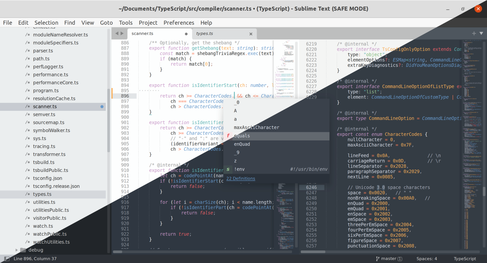

# DESCRIPTION

An integrated development environment (IDE) is **a software application that helps programmers develop software code efficiently**. It increases developer productivity by combining capabilities such as software editing, building, testing, and packaging in an easy-to-use application.

# HISTORY

 Dartmouth was the first language to be created with an IDE (and was also the first to be designed for use while sitting in front of a console or terminal)

# TABLE OF CONTENT

- [**Visual Studio Code**]()

- [**Netbeans**]()
