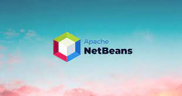

# NETBEANS

# DESCRIPTION

**NetBeans** is an integrated development environment (IDE) for **Java**. NetBeans allows applications to be developed from a set of modular **software components ** called modules. NetBeans runs on [Windows](https://en.wikipedia.org/wiki/Microsoft_Windows "Microsoft Windows"), [macOS](https://en.wikipedia.org/wiki/MacOS "MacOS"), [Linux](https://en.wikipedia.org/wiki/Linux "Linux") and [Solaris](https://en.wikipedia.org/wiki/Solaris_(operating_system) "Solaris (operating system)"). In addition to Java development, it has extensions for other languages like [PHP](https://en.wikipedia.org/wiki/PHP "PHP"), [C](https://en.wikipedia.org/wiki/C_(programming_language) "C (programming language)"), [C++](https://en.wikipedia.org/wiki/C%2B%2B "C++"), [HTML5](https://en.wikipedia.org/wiki/HTML5 "HTML5"),[[3]](https://en.wikipedia.org/wiki/NetBeans#cite_note-3) and [JavaScript](https://en.wikipedia.org/wiki/JavaScript "JavaScript"). 

# HISTORY

NetBeans began in 1996 as Xelfi (word play on *[Delphi](https://en.wikipedia.org/wiki/Borland_Delphi "Borland Delphi")*),[[5]](https://en.wikipedia.org/wiki/NetBeans#cite_note-5)[[6]](https://en.wikipedia.org/wiki/NetBeans#cite_note-6) a Java IDE student project under the guidance of the [Faculty of Mathematics and Physics](https://en.wikipedia.org/wiki/Faculty_of_Mathematics_and_Physics,_Charles_University "Faculty of Mathematics and Physics, Charles University") at [Charles University](https://en.wikipedia.org/wiki/Charles_University "Charles University") in [Prague](https://en.wikipedia.org/wiki/Prague "Prague"). In 1997, Roman Staněk formed a company around the project and produced commercial versions of the NetBeans IDE until it was bought by [Sun Microsystems](https://en.wikipedia.org/wiki/Sun_Microsystems "Sun Microsystems") in 1999. Sun open-sourced the NetBeans IDE in June of the following year. Since then, the NetBeans community has continued to grow.[[7]](https://en.wikipedia.org/wiki/NetBeans#cite_note-7) In 2010, Sun (and thus NetBeans) [was acquired](https://en.wikipedia.org/wiki/Sun_acquisition_by_Oracle "Sun acquisition by Oracle") by [Oracle Corporation](https://en.wikipedia.org/wiki/Oracle_Corporation "Oracle Corporation").

# VERSIONS

- NetBeans IDE 7.0 was released in April 2011. On August 1, 2011, the NetBeans Team released NetBeans IDE 7.0.1

- NetBeans IDE 7.3 was released in February 2013 which added support for HTML5 and web technologies.

- NetBeans IDE 7.4 was released on 15 October 2013.

- NetBeans IDE 8.0 was released on 18 March 2014.

- NetBeans IDE 8.1 was released on 4 November 2015.

- NetBeans IDE 8.2 was released on 3 October 2016.

- Netbeans 9.0, which adds support for Java 9 and 10, was released on 29 July 2018

- NetBeans 10.0 was released on 27 December 2018. It brings support for Java 11 and improved support for PHP (7.0–7.3).

- NetBeans 11.0 was released on 4 April 2019.

- NetBeans 11.3 was released on 24 February 2020.

- NetBeans 13.0 was released on 4 March 2022

- NetBeans 14.0 was released on 9 June 2022.

- NetBeans 15.0 was released on 7 September 2022.

# TABLE OF CONTENTS

### I- BASIC CONFIGURATION

1. [**Configuration**]()

2. [**Extension**]()

3. [**Snippets**]()

4. [**Shortcut**]()
